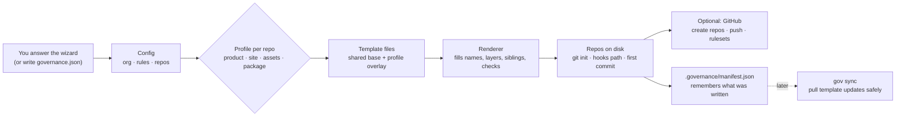
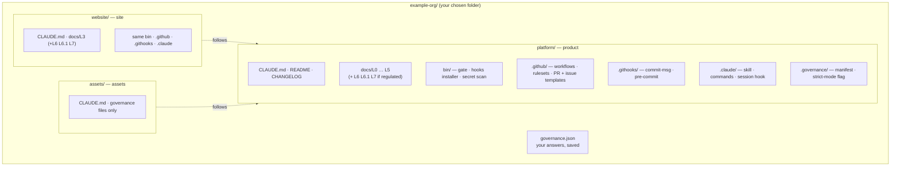
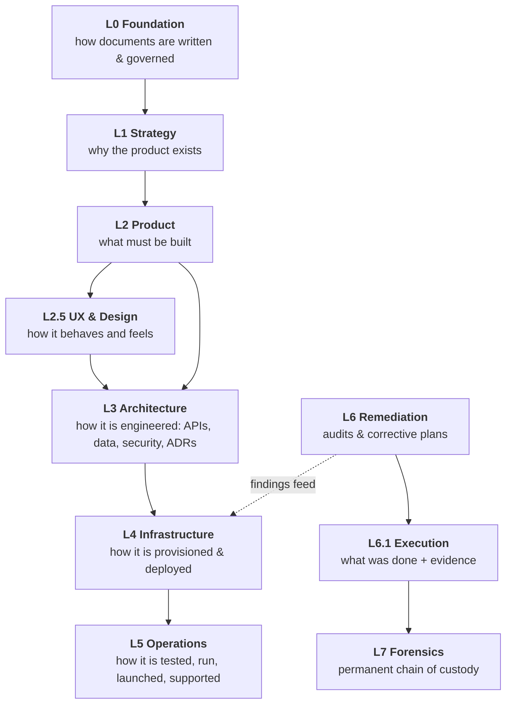
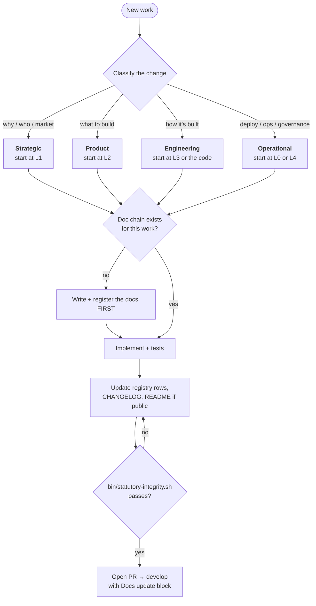
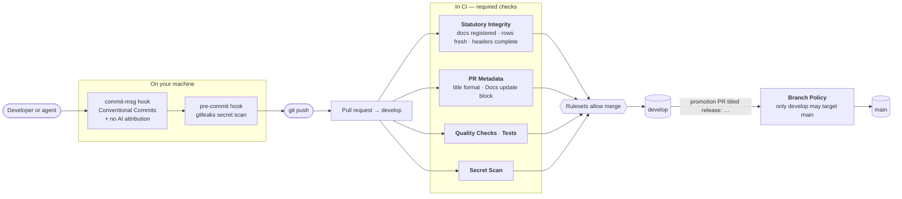
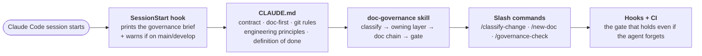
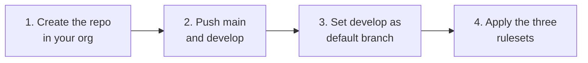

# Soupler Governance Template

**Stand up a complete, enforced documentation-governance system for any organisation or product — in one command.**

Most teams write standards and hope people follow them. This template generates the standards *and* the machinery that enforces them: layered docs, a CI gate, git hooks, branch rulesets, PR templates, and instructions that make coding agents follow the same rules as people.

```bash
pnpm generate
```

Answer a few questions. Get a set of repositories where **no document goes unregistered, no PR skips its docs, no commit breaks the format, and no feature branch reaches `main`** — and where Claude Code reads the rules before it touches a line.

---

## Contents

1. [What you get](#what-you-get)
2. [How it works](#how-it-works)
3. [Quick start](#quick-start)
4. [The wizard, question by question](#the-wizard-question-by-question)
5. [What gets generated](#what-gets-generated)
6. [The documentation layers](#the-documentation-layers)
7. [How a change flows](#how-a-change-flows)
8. [How the rules are enforced](#how-the-rules-are-enforced)
9. [How coding agents are kept on the rails](#how-coding-agents-are-kept-on-the-rails)
10. [Repository types](#repository-types)
11. [Publishing to GitHub](#publishing-to-github)
12. [Day-two commands](#day-two-commands)
13. [Adopting into existing repos](#adopting-into-existing-repos)
14. [Configuration reference](#configuration-reference)
15. [FAQ](#faq)
16. [Develop this template](#develop-this-template)

---

## What you get

| | |
|---|---|
| **Layered docs** | `docs/L0 … L7`: standards, strategy, product, design, architecture, infrastructure, operations, remediation, execution evidence, forensics. Every layer has a registry. |
| **A gate that cannot be argued with** | `Statutory Integrity` fails a PR if any doc is unregistered (subfolders included), any registry row is stale, or a header is incomplete. |
| **Git conventions, enforced** | Conventional Commits and optional no-AI-attribution via a `commit-msg` hook; secret scanning pre-commit and in CI. |
| **One promotion path** | feature → `develop` → `main`, and *only* `develop` may PR into `main`. Rulesets plus a CI check, because rulesets alone cannot see a PR's source branch. |
| **PRs that carry their docs** | The PR template's `## Docs update` block (`UPDATED` / `EXEMPT` + notes) is parsed by CI. Blank fails. |
| **Agent instructions** | A governance-first `CLAUDE.md` per repo type, a `doc-governance` skill, slash commands, and a session-start hook. |
| **Multi-repo awareness** | Each repo knows its siblings, which repo owns which fact, and which direction truth flows. |
| **Safe updates** | `gov sync` pulls template improvements into existing repos and never overwrites something you edited. |

---

## How it works



Zero dependencies. Plain Node. The generated repos have no runtime dependency on this template — they carry their own scripts.

---

## Quick start

**Prerequisites:** Node 20+, pnpm, git. `gh` (GitHub CLI, logged in) only if you want it to create the GitHub repos.

```bash
git clone git@github.com:soupler-labs/soupler-governance-template.git
cd soupler-governance-template
pnpm generate
```

Prefer to preview first? Write a `governance.json` (see [`examples/`](examples/)) and run:

```bash
node bin/gov.mjs new-org ~/code/example-org --config governance.json --dry-run
```

After scaffolding, in each repo:

```bash
cd ~/code/example-org/platform
bash bin/install-hooks.sh          # commit-msg + pre-commit hooks (once per clone)
bash bin/statutory-integrity.sh    # the gate CI runs — should print SUCCESS already
```

Then open that repo's `CLAUDE.md` and fill in the `TODO` lines (what the product is, the stack, the apps map). The agent navigates by them.

---

## The wizard, question by question

Below is a complete, realistic run for a hypothetical company **Example Org**, building a product with a website and a brand-assets repo. Every question shows what to type, why, and what it changes.

> Press **Enter** to accept any `[default]`. Nothing is written until the final confirmation; answering `n` there writes nothing.

### Part 1 — The organisation

| # | Question | Example answer | What it does |
|---|---|---|---|
| 1 | **Organisation / company name** | `Example Org` | Used in every document header, copyright line, `CLAUDE.md` and README. Also derives the folder slug (`example-org`). |
| 2 | **Owner shown in document headers** | *(Enter → `Example Org`)* | Fills the `Owner` field of every generated doc. Use the **company or team name**, not a person — people change, the registry should not. |
| 3 | **GitHub organisation/user that will own the repos** | `example-org` | Where repos are created when you publish (`example-org/platform`), and what the ruleset commands target. Doesn't touch GitHub until you opt in later. |
| 4 | **Folder to create everything in** | `~/code/example-org` | Absolute or `~` path. One subfolder is created per repo, plus `governance.json`. Default is `./<slug>` under where you ran the command. |

### Part 2 — The rules

| # | Question | Example answer | What it does |
|---|---|---|---|
| 5 | **Regulated / audit-sensitive?** | `n` for most products; `y` if you handle personal data, payments, health, or must prove how defects were fixed | `y` adds the remediation layers **L6** (audit + plan), **L6.1** (execution evidence) and **L7** (forensic chain of custody), plus the remediation rules in `CLAUDE.md`. `n` keeps L0–L5 for product repos. |
| 6 | **Integration branch** | *(Enter → `develop`)* | The branch all work PRs into. `main` only ever receives this branch. Baked into rulesets, `CLAUDE.md`, hooks and the default branch on GitHub. Keep `develop` unless you really want a single-branch flow. |
| 7 | **Block AI attribution in commits and PRs?** | *(Enter → `y`)* | `y`: the `commit-msg` hook rejects `Co-Authored-By: Claude`, "Generated with…" and session links, and CI rejects them in PR bodies. `n`: those checks aren't generated. |

### Part 3 — The repositories

You add repositories one at a time. For each you answer five things, then choose whether to add another. A typical product has three.

**Repo 1 — the product codebase**

| Question | Example answer | What it does |
|---|---|---|
| Repo name (kebab-case) | `platform` | Folder name and GitHub repo name. Lowercase, hyphens only. |
| Type | `product` | Picks the layer set, workflows and `CLAUDE.md` style. See [Repository types](#repository-types). |
| One-line description | `Parcel shipping and freight marketplace: mobile app, admin, backend services.` | Appears in the repo's README, in siblings' `CLAUDE.md`, and in the GitHub repo description. |
| Follows which repos? | *(blank)* | The main codebase doesn't follow anyone — others follow *it*. |
| Source of truth for? | `brand mark and palette, API contracts, shared data models` | Rendered as "this repo is the source of truth for…" so agents never edit those things in a follower. |

**Repo 2 — the public website**

| Question | Example answer | What it does |
|---|---|---|
| Repo name | `website` | |
| Type | `site` | Gets L3 (and L6/L6.1/L7 if regulated). No L0 copy — it points at the standards repo. |
| Description | `Public marketing site, deployed to example.org.` | |
| Follows which repos? | `platform` | Its `CLAUDE.md` will say: *"follows platform, never the reverse — change brand/product facts there first."* |
| Source of truth for? | *(blank)* | |

**Repo 3 — brand assets**

| Question | Example answer | What it does |
|---|---|---|
| Repo name | `assets` | |
| Type | `assets` | Minimal: no doc layers, just governance files and an "I follow, I never lead" `CLAUDE.md`. |
| Description | `Logo family, social templates and campaign renders.` | |
| Follows which repos? | `platform` | |
| Source of truth for? | *(blank)* | |

When asked **"Add another repository?"** answer `y` until you've entered them all, then `n`.

> **Direction matters.** "Follows" points at the repo that *leads*. If `website` follows `platform`, then a brand-colour change is made in `platform` first and copied to `website` afterwards — never the reverse. Getting this backwards produces agent instructions that tell Claude to edit the wrong repo.

### Part 4 — The wiring

| # | Question | Example answer | What it does |
|---|---|---|---|
| — | **Which repo holds the org-wide L0 standards?** *(only asked when there are several repos)* | *(Enter → `platform`)* | That repo gets the full `docs/L0-foundation/` set (naming, change propagation, engineering principles…). Other repos point to it instead of copying, so there is **one** set of standards. |
| — | **Package manager** | `pnpm` | Fills install/lint/type-check/test commands in CI and `CLAUDE.md`. Choosing `npm` or `yarn` rewrites those commands accordingly. |
| — | **Node version** | `22.15.0` | Used in CI and the setup docs. |
| — | **Create the repos on GitHub and apply rulesets now?** | `n` the first time | `y` queues the GitHub step — and it **asks again with the full plan** before touching anything. |
| — | **Create this now?** | `y` | The final gate. A summary of everything is shown first. `n` writes nothing. |

### The summary you'll see

```
── Summary ─────────────────────────────────────────
  Org        Example Org (GitHub: example-org)
  Location   /Users/you/code/example-org
  Layers     standard
  Repo       platform  [product]  (holds L0 standards)
  Repo       website   [site]
  Repo       assets    [assets]
  GitHub     not now

Create this now? (y/n) [y]:
```

---

## What gets generated



Every repo is already a git repository on `main`, with one initial commit, a `develop` branch, and `core.hooksPath` pointed at `.githooks`.

---

## The documentation layers

Each layer owns **one** kind of decision. Cross-layer *links* are encouraged; cross-layer *ownership duplication* is forbidden.



| Layer | Owns | Typical artifacts |
|---|---|---|
| **L0** | How artifacts are written and governed | naming rules, change-propagation, engineering principles |
| **L1** | Why the product exists; how success is measured | vision, ICP, market, positioning |
| **L2** | What must be built | PRDs, feature briefs, roadmap |
| **L2.5** | How it behaves and feels | user flows, wireframes, design system |
| **L3** | How it is engineered | system architecture, API contracts, data model, security, ADRs |
| **L4** | How it is provisioned and deployed | environments, CI/CD, runbooks, cost |
| **L5** | How it is tested, operated, supported | test playbook, incident runbooks, launch |
| **L6** *(regulated)* | What was found broken | `R-NNN` audit + plan per session |
| **L6.1** *(regulated)* | What was done, with proof | tactical checklist + walkthrough evidence |
| **L7** *(regulated)* | The permanent record | master registry: finding → plan → evidence → merged PR |

---

## How a change flows

The **Golden Rule**: *the layer that owns the problem gets the first edit. Downstream layers sync to it — never the reverse.*



**Doc-first table** (also in every generated `CLAUDE.md`):

| Work type | Docs that must exist before the first line of code |
|---|---|
| New feature | L2 brief → L3 spec (API / data model) → L5 test-playbook section |
| Defect remediation *(regulated)* | L6 audit → L6 plan → implement → L6.1 execution → L6.1 evidence → L7 row |
| Infrastructure change | L4 runbook section → L3 ADR if it introduces a new pattern |
| Strategy / pricing / GTM | L1 doc → L2 PRD if product scope follows |

---

## How the rules are enforced

A rule that is only written down gets broken. Every rule here has a mechanism.



| Rule | Mechanism |
|---|---|
| Every doc is registered; no stale rows; versions/dates match each file | `bin/statutory-integrity.sh` → CI `Statutory Integrity` |
| Complete document headers; Document ID equals filename | same gate, strict mode |
| PR title is a Conventional Commit; promotion PRs start `release:` | CI `PR Metadata` |
| PR body has `- Status: UPDATED/EXEMPT` and real `- Notes:` | CI `PR Metadata` |
| Commit subject is a Conventional Commit | `.githooks/commit-msg` |
| No AI attribution in commits or PR text *(optional)* | `commit-msg` hook + CI |
| No secrets committed | `pre-commit` + CI `Secret Scan` |
| `main` only receives `develop` | CI `Branch Policy` (rulesets can't see a PR's source branch) |
| PR-only, no force-push, squash/rebase on `develop`, merge-commit on `main`, no deletion | three GitHub **rulesets** applied by `gov github` |

> **Strict vs adoption mode.** New repos are generated strict (`.governance/sive.json` → `{ "strict": true }`): every header and registry problem fails the build. When you adopt the gate into an existing repo, it starts in *adoption mode*: unregistered docs still fail, but header and stale-row findings are warnings, so you can switch CI on without rewriting history first. Flip to strict once the registries are clean.

---

## How coding agents are kept on the rails

Instructions in a file get forgotten mid-session. So the template layers four mechanisms:



What the agent is told, in every repo, before any change:

1. **Classify the change** — strategic, product, engineering or operational.
2. **Edit the owning layer first.** Downstream docs and code follow.
3. **Doc-first.** If the chain is missing, write and register it before code.
4. **Register every doc**; keep registry rows' versions and dates accurate.
5. **Update the CHANGELOG**; README if setup or public behaviour changed.
6. **Run the gate** before saying "done".
7. **Commit and push only when the user asks.** Never branch without asking.
8. **Engineering principles:** modular boundaries · never duplicate code · one source of truth per fact · centralised design tokens · shipped clients never fall back to localhost · verify before asserting · fix now, don't defer.

The full text of the principles — with the *reason* behind each — is `docs/L0-foundation/L0-009-engineering-principles-v1.md`. Rules without reasons get deleted by the next person who finds them inconvenient; each one here records the failure it prevents.

---

## Repository types

| Type | Use it for | Doc layers | Notes |
|---|---|---|---|
| **`product`** | The main codebase: apps, services, shared packages | L0–L5 *(+ L6, L6.1, L7 if regulated)* | Usually holds the org's L0 standards. Gets the long-form `CLAUDE.md` with testing, definition of done and engineering principles. |
| **`site`** | A public website | L3 *(+ L6, L6.1, L7 if regulated)* | Points at the standards repo for L0. Has its own audits and its own chain of custody. |
| **`assets`** | Brand and static media | none | Follows the product: tokens and marks are copied from the owner, never invented here. |
| **`package`** | Shared content or library consumed by other repos via a pinned tag | none | The single place a fact is edited; consumers bump their pin. |

Each repo that runs remediation keeps its **own** L6 → L6.1 → L7 chain; session numbers are per-repo, so cite another repo's session as "website R-012".

---

## Publishing to GitHub

**Automatic (recommended).** Answer `y` to *"Create the repos on GitHub and apply branch rulesets now?"* in the wizard (or pass `--github` to `new-org`). For each repo it runs, **in this order**:



The order is not negotiable: the rulesets make `main` and `develop` PR-only, so they would reject the very first push if applied before it. The plan is printed and you confirm before anything happens.

**Manual, or finishing a repo you already pushed.** If you answered `n`, created the repo yourself, or only pushed `main`:

```bash
# one command: creates the repo if missing, pushes main + develop (never resets an existing develop),
# sets the default branch, applies the rulesets
node bin/gov.mjs github ~/code/example-org/platform
```

Doing it by hand instead is the same four steps:

```bash
gh repo create example-org/platform --private          # 1. skip if it exists
git push -u origin main && git push -u origin develop  # 2. both branches
gh repo edit example-org/platform --default-branch develop   # 3.
node bin/gov.mjs github ~/code/example-org/platform --rulesets-only   # 4.
```

> **Plan limit.** Rulesets need a paid GitHub plan (Team/Pro) for private repos, or a public repo. On a free plan step 4 is reported and skipped; everything else works, but branch protection is **not enforced** until you upgrade and re-run `--rulesets-only`.

---

## Day-two commands

```bash
# Add another repo later — every sibling's topology refreshes automatically
node bin/gov.mjs add-repo mobile-kit --profile package --org-dir ~/code/example-org --description "Shared kit"

# See whether a repo has drifted from the template (exit 1 if so — good for a scheduled job)
node bin/gov.mjs sync ~/code/example-org/platform --check

# Pull template updates in (never overwrites a file you edited)
node bin/gov.mjs sync ~/code/example-org/platform

# Publish one repo to GitHub: create if missing, push main + develop, set default branch, apply rulesets
# (idempotent — also the way to finish a repo you pushed by hand)
node bin/gov.mjs github ~/code/example-org/platform

# Only (re)apply the rulesets, e.g. after upgrading the GitHub plan
node bin/gov.mjs github ~/code/example-org/platform --rulesets-only

# Run a repo's gate from outside it
node bin/gov.mjs audit ~/code/example-org/platform
```

**How `sync` treats files**

| File kind | Examples | On sync |
|---|---|---|
| **Managed** | hooks, workflows, gate script, rulesets, the skill and commands | Updated if you haven't touched it; if you *have*, the new version is written beside it as `<file>.governance-new` for you to review. |
| **Seeded** | `CLAUDE.md`, README, CHANGELOG, `docs/` | Written once, then yours. Only the marked `gov:begin … gov:end` regions (sibling lists, layer tables, repo topology) are refreshed. |
| **Advisory** | L0 standards you've edited | Reported as "template has a newer version" — you merge by hand, because they carry your registry rows. |

---

## Adopting into existing repos

Already have a repo? Stamp governance in without disturbing it:

```bash
# Preview — writes nothing
node bin/gov.mjs adopt ~/code/my-repo --config governance.json --repo platform --dry-run

# Apply managed files only (gate, hooks, workflows, rulesets, skill)
node bin/gov.mjs adopt ~/code/my-repo --config governance.json --repo platform

# Also seed missing docs, CLAUDE.md, README, CHANGELOG (never overwrites existing ones)
node bin/gov.mjs adopt ~/code/my-repo --config governance.json --repo platform --docs
```

Where a managed file already exists and differs, you get `<file>.governance-new` and nothing is overwritten. The gate starts in adoption mode.

---

## Configuration reference

Everything the wizard asks is saved to `governance.json`, so you can skip the wizard next time.

```json
{
  "org": {
    "name": "Example Org",
    "github": "example-org",
    "owner": "Example Org",
    "regulated": false,
    "standardsRepo": "platform",
    "defaultBranch": "develop"
  },
  "rules": { "noAiAttribution": true, "releasePrTitle": "release" },
  "stack": { "packageManager": "pnpm", "node": "22.15.0", "pnpm": "9.15.9" },
  "repos": [
    { "name": "platform", "profile": "product", "description": "…", "owns": ["API contracts"] },
    { "name": "website",  "profile": "site",    "follows": ["platform"] }
  ]
}
```

| Key | Meaning | Default |
|---|---|---|
| `org.name`, `github`, `owner`, `copyright`, `license` | Identity used in headers and docs | owner/copyright = org name; license `Proprietary` |
| `org.regulated` | Adds L6, L6.1, L7 | `false` |
| `org.standardsRepo` | The one repo that holds L0 | first `product` repo |
| `org.defaultBranch` | Integration branch | `develop` |
| `org.requiredReviews` | Approvals the rulesets require | `0` |
| `org.codeowners` | e.g. `@example-org/maintainers` → `.github/CODEOWNERS` | none |
| `layerFolders` | Rename a layer folder, e.g. `{ "L3": "L3-engineering" }` | defaults |
| `rules.noAiAttribution` | Hook + CI block AI attribution | `true` |
| `rules.releasePrTitle` | Prefix for `develop`→`main` PR titles | `release` |
| `rules.requireDocsUpdate` | CI requires the `## Docs update` block | `true` |
| `commands` | install / lint / typeCheck / test | pnpm defaults |
| `repos[].profile` | `product` · `site` · `assets` · `package` | required |
| `repos[].follows` / `owns` | Source-of-truth direction | none |
| `repos[].layers` | Override the type's default layers | type default |

---

## FAQ

**Do I need GitHub to use this?** No. Without the GitHub answer, everything is local files and git. Publishing is a separate, confirmed step.

**Do the rulesets work on private repos?** Only on a paid GitHub plan (Team/Pro) or for public repos. On a free plan GitHub returns HTTP 403 for rulesets; the generator reports that clearly and continues. Hooks, CI jobs and the PR workflows still run, but branch protection (PR-only, required checks, no force-push) is **not enforced** until you upgrade or make the repo public, then run `gov github <repo-dir>`.

**Will it touch GitHub without asking?** Never. It prints the exact plan and waits for `y`. Non-interactive runs refuse unless you pass `--yes`.

**Can I change answers later?** Re-run into a new folder, or edit the generated files directly. `gov sync` reads each repo's own `.governance/manifest.json`, so editing the top-level `governance.json` doesn't change existing repos.

**Why `@@ … @@` in the templates instead of `{{ }}`?** Generated files are full of GitHub Actions' `${{ … }}`. Different delimiters avoid collisions.

**Why is there no `package.json` in the generated repos?** The scaffold is stack-neutral: governance files only. Your app's tooling is yours. CI and docs assume the commands you gave the wizard.

**Can a repo have the full L0–L7 chain?** Yes — set `repos[].layers` in `governance.json`. Usually only the product repo needs it; other repos reference its L0 and keep the layers they genuinely own.

**What if I don't want a rule?** Rules in `governance.json` (`noAiAttribution`, `requireDocsUpdate`) switch off cleanly. Anything else, delete after generating — managed files will then show as drift on `sync --check`, which is the point.

---

## Develop this template

```bash
pnpm test        # generates real orgs, runs their gates, hooks and sync — no dependencies
pnpm generate    # run the wizard
```

Read [CLAUDE.md](CLAUDE.md) before changing anything: it explains the architecture, the file kinds, and the rules for contributing. [docs/usage.md](docs/usage.md) has the long-form CLI guide.

Zero runtime dependencies · Node ≥ 20.

---

## License and contributing

Copyright 2026 Soupler. Licensed under the [Apache License 2.0](LICENSE) - you may use, modify and redistribute this template, including to enforce documentation standards in your own organisation, under the terms of that license (see [NOTICE](NOTICE)). **What you generate is yours:** the license places no restriction on repositories and documents produced by the generator.

This repository is open source but maintained by Soupler: `main` and `develop` are protected, every change goes through a pull request, and only the maintainer approves and merges. Contributions are welcome through forks - see [CONTRIBUTING.md](CONTRIBUTING.md). Report vulnerabilities privately per [SECURITY.md](SECURITY.md).
